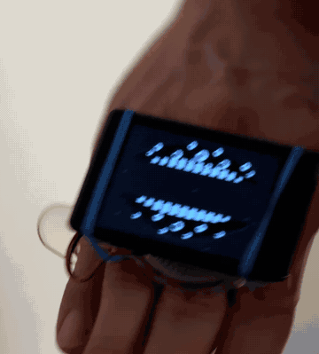

# Tsugai: Gabriel

Gabriel (가브리엘): two jaws studded with eyes, worn on the back of your hand.



Strap an ESP32-S3 board to your hand like a gauntlet. Gabriel waits with his
jaws open and his eyes wandering. Snap your fist shut and he bites: the jaws
slam together, flash, hold for a moment, and open again. The on-board QMI8658
motion sensor picks up the snap as a jolt, so it doesn't matter which way
round the board sits on your hand.

Hold a finger on the screen and every eye turns to watch it. A quick tap
bites.

Split out of [esp32-nametag-studio](https://github.com/mommocmoc/esp32-nametag-studio).

## Hardware

- **Waveshare ESP32-S3-Touch-LCD-2**: 2.0" ST7789 320×240 IPS, CST816 touch,
  QMI8658 IMU
- A USB-C data cable
- Something to strap it to your hand

No IMU? Tapping the screen bites instead. With no touch either, Gabriel plays
on his own every few seconds.

## Quick start

```bash
./tools/setup.sh     # arduino-cli, ESP32 core, GFX library (idempotent)
./tools/build.sh     # compile only, no board needed
./tools/flash.sh     # compile + upload (auto-detects the port)
./tools/monitor.sh   # serial log at 115200
```

If the upload won't start, hold **BOOT**, tap **RESET**, release **BOOT**, and
run `flash.sh` again.

## Tuning

Everything you're likely to change is in [`gabriel/config.h`](gabriel/config.h):

| Setting | What it does |
|---|---|
| `SNAP_FORCE` | How hard a snap has to be, in g. 0.30 fires on a light tap; 0.60 needs a real snap. |
| `SNAP_COOLDOWN_MS` | Dead time after a bite, so one snap gives one bite |
| `IDLE_OPEN_PCT` | How wide the jaws stay open while he waits |
| `INTRO_ON_BOOT` | Play the full arrival (smoke, eyes opening, the stare) at boot |
| `TOUCH_ENABLED` | A tap on the screen bites too |
| `EYES_FOLLOW_TOUCH` | Every eye follows a finger held on the screen |
| `TAP_BITE_MS` | Touches shorter than this bite; longer ones only get watched |
| `DEBUG_FORCE` | Print the strongest jolt twice a second, to help you pick `SNAP_FORCE` |
| `SCREEN_BRIGHTNESS`, `SCREEN_ROTATION` | Display |

To calibrate: leave `DEBUG_FORCE` on, run `./tools/monitor.sh`, snap your hand
a few times, and set `SNAP_FORCE` a little below the peaks you see. Turn
`DEBUG_FORCE` off when you're done.

## Files

| File | What it holds |
|---|---|
| `gabriel/gabriel.ino` | setup, the snap detector, the idle loop |
| `gabriel/config.h` | every setting you're meant to change |
| `gabriel/gabriel.h` | Gabriel himself: palette, eyes, jaws, the intro, the chomp |
| `gabriel/imu.h` | the QMI8658 accelerometer |
| `gabriel/touch.h` | the CST816 touch panel |
| `gabriel/lowres.h` | the 160×120 canvas, drawn to the LCD at 2× |

## License

MIT. See [LICENSE](LICENSE). Gabriel is fan art of a character from Hiromu
Arakawa's *Daemons of the Shadow Realm* (黄泉のツガイ).
